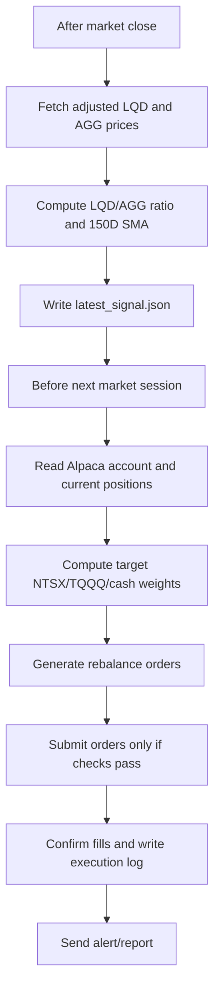

# NTSX + Tactical TQQQ Alpaca Handoff

This document explains how to implement the strategy we found most interesting in the QQQ research project:

> Hold a defensive capital-efficient core, then use a signal to decide when the unused cash sleeve should be deployed into TQQQ.

This is a production handoff, not a research note. Its job is to explain what the bot should do, where it should run, what data it needs, how Alpaca fits in, and what safeguards need to exist before real money is used.

This is not financial advice. Leveraged ETFs can lose money quickly, especially during volatile markets.

## Strategy Summary

The initial production candidate is:

```text
67% NTSX
33% cash when signal is OFF
33% TQQQ when signal is ON
```

The intended behavior is simple:

- Stay invested in NTSX every day.
- Use the 33% sleeve as dry powder.
- When the signal says risk-on, move the 33% sleeve into TQQQ.
- When the signal says risk-off, sell TQQQ and return that sleeve to cash.

NTSX is used as the core because it gives equity plus Treasury exposure in one ETF. Roughly speaking, 100% NTSX targets about 90% equity exposure and 60% Treasury futures exposure. A 67% NTSX allocation therefore gives about 60% equity exposure and 40% Treasury exposure before the TQQQ sleeve is added.

## Production Rule Set

Use this as version 1:

```text
Signal name: lqd_agg_risk_on

Inputs:
  LQD adjusted close
  AGG adjusted close

Feature:
  lqd_agg_ratio = LQD adjusted close / AGG adjusted close
  lqd_agg_ratio_sma150 = 150 trading day simple moving average of lqd_agg_ratio

Signal ON:
  lqd_agg_ratio >= lqd_agg_ratio_sma150

Signal OFF:
  lqd_agg_ratio < lqd_agg_ratio_sma150
```

Interpretation:

- LQD represents investment-grade corporate bonds.
- AGG represents broad core bonds.
- When LQD is outperforming AGG, credit markets are acting more risk-on.
- When LQD is underperforming AGG, credit markets are acting more defensive.
- The rule uses the ratio versus its own 150-day average to avoid relying on an arbitrary fixed threshold.

Use adjusted close or total-return data for this signal. LQD and AGG pay distributions, so raw close can distort the ratio over time. Adjusted close attempts to account for splits and distributions. Total-return data is even better when available because it directly measures reinvested return.

## Backtest Evidence

The supporting research file is:

```text
analysis_output/ntsx_tqqq_cash_sleeve/ntsx_tqqq_cash_sleeve_report.md
```

The tested sample was:

```text
2018-08-02 through 2026-05-06
```

This date range is constrained by live NTSX history.

Key live-sample results:

| Portfolio | CAGR | Sharpe | Max Drawdown | Notes |
| --- | ---: | ---: | ---: | --- |
| QQQ buy and hold | 19.86% | 0.90 | -36.69% | Aggressive benchmark |
| 67% NTSX / 33% cash | 9.75% | 0.87 | -22.26% | Defensive core |
| 67% NTSX / 33% TQQQ always | 23.47% | 0.81 | -53.41% | High return, ugly drawdown |
| 67% NTSX / 33% TQQQ using LQD/AGG signal | 26.09% | 1.12 | -31.61% | Cleaner first production candidate |

The more aggressive combo signal, `lqd_or_dxy_or_vol`, had higher CAGR in the backtest, but it was active about 80% of the time. That makes it closer to a mostly-on leveraged allocation. For a first automated implementation, the cleaner `lqd_agg_risk_on` rule is easier to monitor and explain.

## Daily Execution Logic

The research backtest used close-known signals and next-open execution. In production, this should translate into a two-stage daily process.



Recommended schedule:

| Time | Job | Action |
| --- | --- | --- |
| 4:15 PM ET | Signal job | Fetch LQD/AGG adjusted data, compute signal, save state |
| 9:25 AM ET | Preflight job | Confirm market calendar, account status, positions, buying power, stale data checks |
| 9:35 AM ET | Rebalance job | Submit orders if target differs enough from actual portfolio |
| 9:45 AM ET | Fill check | Confirm fills, log slippage, alert if anything failed |

The backtest assumes next-open fills. Real execution at the exact open can be noisy. A practical first version should trade shortly after the open, such as 9:35 AM ET, then measure slippage versus the open. If exact open execution is required later, test it separately with paper trading first.

## Target Portfolio Calculation

Let:

```text
equity = Alpaca account equity
signal_on = true or false
```

If signal is OFF:

```text
NTSX target value = 0.67 * equity
TQQQ target value = 0.00 * equity
Cash target value = 0.33 * equity
```

If signal is ON:

```text
NTSX target value = 0.67 * equity
TQQQ target value = 0.33 * equity
Cash target value = 0.00 * equity
```

Use a rebalance threshold so the bot does not trade for tiny differences:

```text
minimum trade = max($25, 0.25% of account equity)
```

The order planner should:

1. Read current NTSX and TQQQ market values.
2. Compute target dollar values.
3. Compute deltas.
4. Sell overweight positions first.
5. Buy underweight positions after cash is available.
6. Skip orders below the minimum trade threshold.
7. Never submit duplicate orders for the same rebalance date and symbol.

## Alpaca Implementation

Use Alpaca for brokerage execution. The bot should use paper trading first, then live trading only after the paper account runs cleanly.

Alpaca's Python SDK supports a `TradingClient` with a `paper=True` flag for paper trading, according to the official Alpaca Python SDK docs. Alpaca also documents that paper trading uses the `https://paper-api.alpaca.markets` domain, and that API authentication uses `APCA-API-KEY-ID` and `APCA-API-SECRET-KEY` headers when calling the REST API directly.

Useful Alpaca docs:

- [Alpaca order documentation](https://docs.alpaca.markets/docs/trading/orders/)
- [Alpaca TradingClient docs](https://alpaca.markets/sdks/python/api_reference/trading/trading-client.html)
- [Alpaca base URL enum docs](https://alpaca.markets/sdks/python/api_reference/common/enums.html)
- [Alpaca authentication reference](https://docs.alpaca.markets/v1.3/reference)
- [Alpaca fractional order support](https://alpaca.markets/support/how-can-i-pass-a-fractional-order)

Recommended order type for paper version:

```text
type = market
time_in_force = day
```

Fractional orders are convenient for smaller accounts, but keep the implementation conservative. If fractional orders create validation errors, fall back to whole-share quantities or use dollar-notional orders only where Alpaca supports them.

Every order should include a deterministic client order id:

```text
ntsx-tqqq-YYYYMMDD-SYMBOL-SIDE
```

Example:

```text
ntsx-tqqq-20260508-TQQQ-buy
```

This makes the bot idempotent. If it runs twice by accident, it can detect whether today's order already exists.

## Proposed Repository Structure

Add this implementation as a separate live-trading module:

```text
live_trading/
  README.md
  config.example.toml
  compute_lqd_agg_signal.py
  alpaca_rebalance.py
  run_after_close.py
  run_before_open.py
  state/
    latest_signal.example.json
  logs/
```

The production files should do the following:

| File | Purpose |
| --- | --- |
| `config.example.toml` | Safe defaults, no secrets |
| `compute_lqd_agg_signal.py` | Fetch adjusted LQD/AGG history and compute ON/OFF signal |
| `alpaca_rebalance.py` | Read account, compute target weights, generate and optionally submit orders |
| `run_after_close.py` | End-of-day data refresh and signal write |
| `run_before_open.py` | Preflight plus rebalance |
| `state/latest_signal.json` | Last valid signal, timestamp, data source, ratio, SMA |
| `logs/*.jsonl` | Daily decision, order plan, API responses, fill report |

The first code version should default to dry-run:

```bash
python live_trading/run_before_open.py --dry-run
```

It should print the exact orders it would submit, but should not place them.

Live submission should require an explicit flag:

```bash
python live_trading/run_before_open.py --submit
```

## Where This Should Be Hosted

Best first choice:

```text
An always-on cloud VM running a small Python service with systemd timers.
```

Good options:

- AWS Lightsail
- AWS EC2
- DigitalOcean Droplet
- Hetzner Cloud
- Fly.io or Render, if the scheduler and persistent logs are configured carefully

The bot does not need heavy compute. It needs reliability, stable scheduling, persistent logs, secure secrets, and outbound internet access.

Recommended production setup:

```text
Ubuntu VM
Python virtual environment
Git checkout of this repo
systemd timers for after-close and before-open jobs
environment file or cloud secrets manager for Alpaca keys
logs written to disk and optionally shipped to cloud storage
email/Slack alert for every order plan and failure
```

Acceptable for paper testing:

```text
Your Mac using launchd or cron, as long as it is awake and connected.
```

Not recommended as the main live host:

```text
GitHub Actions
```

GitHub Actions can be useful for nightly research refreshes, reports, or backtests, but it is not ideal as the primary live trading host. It has scheduler jitter, runtime limits, less predictable market-open timing, and secrets are attached to CI rather than a controlled trading runtime.

## How It Works Once Hosted

The hosted bot runs two scheduled jobs.

First, the after-close job:

1. Pull the latest LQD and AGG adjusted daily prices.
2. Confirm both assets have the same latest trading date.
3. Compute the LQD/AGG ratio.
4. Compute the 150-day SMA.
5. Decide signal ON/OFF.
6. Save `latest_signal.json`.
7. Send a short report.

Example signal state:

```json
{
  "as_of": "2026-05-08",
  "data_source": "yfinance_adjusted",
  "lqd_agg_ratio": 1.2345,
  "lqd_agg_ratio_sma150": 1.2100,
  "signal_name": "lqd_agg_risk_on",
  "signal_on": true,
  "strategy": "ntsx67_tqqq33_lqd_agg_risk_on"
}
```

Second, the morning rebalance job:

1. Read `latest_signal.json`.
2. Check that the signal is recent enough.
3. Query Alpaca account equity.
4. Query current NTSX and TQQQ positions.
5. Compute target portfolio weights.
6. Build an order plan.
7. Check kill switch, open orders, market clock, and buying power.
8. Submit orders only when explicitly enabled.
9. Confirm fills and write a log record.

## Secrets And Access Control

Never commit API keys.

Use environment variables or a secrets backend:

```bash
export APCA_API_KEY_ID="..."
export APCA_API_SECRET_KEY="..."
export APCA_PAPER="true"
```

For a cloud VM, use one of these:

- An encrypted `.env` file readable only by the trading user.
- AWS Secrets Manager.
- GCP Secret Manager.
- HashiCorp Vault.

Minimum requirements:

- Separate paper and live keys.
- Rotate keys if they were pasted into chat, logs, screenshots, notebooks, or Git history.
- Use least privilege where the broker supports it.
- Never print secret values in logs.
- Mask secrets in CI, terminal history, and alerting systems.

## Required Safety Checks

The bot should refuse to submit orders if any of these are true:

- Signal file is missing.
- Signal is stale.
- LQD or AGG latest price is missing.
- Alpaca account is blocked from trading.
- There are unexpected open orders.
- Current positions include symbols outside the approved universe, unless explicitly allowed.
- Target TQQQ weight is above 33%.
- Target NTSX weight is above 67%.
- Account equity is missing or non-positive.
- Estimated order value is below minimum threshold.
- Kill switch file exists.

Recommended kill switch:

```text
live_trading/state/KILL_SWITCH
```

If this file exists, the bot should do nothing except report that trading is disabled.

## Monitoring And Drift

Once this becomes automated, it is no longer just a backtest. It becomes a live model pipeline. The signal must be monitored for drift.

Track these daily:

- Signal ON/OFF.
- LQD/AGG ratio.
- Distance from 150-day SMA.
- Days since last signal flip.
- Actual NTSX/TQQQ/cash weights.
- Slippage versus expected execution price.
- Realized return versus backtest-implied return.
- Drawdown.
- TQQQ active-day percentage.
- Rolling 3-month, 6-month, and 12-month performance versus the core portfolio.

Review rules:

- If the signal remains ON or OFF far longer than historical norms, inspect it.
- If slippage is consistently worse than expected, change execution timing or order type.
- If realized drawdown exceeds the backtest's expected range, pause and review.
- If the signal stops adding value versus `67% NTSX / 33% cash`, reduce size or paper trade until edge returns.

## Paper Trading Acceptance Checklist

Before live trading:

- Run dry-run locally for at least one week.
- Run paper trading for at least one full signal cycle, ideally longer.
- Confirm no duplicate orders on repeated runs.
- Confirm stale data causes no-trade behavior.
- Confirm kill switch works.
- Confirm logs contain signal, target weights, order ids, and fills.
- Confirm alerts arrive after every run.
- Compare paper fills to the research assumption.
- Confirm tax and account constraints are acceptable.

## Open Implementation Decisions

These should be decided before live money:

| Decision | Default Recommendation |
| --- | --- |
| Signal data source | Adjusted close from yfinance for v1, then upgrade to Tiingo/Norgate/Polygon if needed |
| Execution time | 9:35 AM ET |
| Order type | Market/day for paper, revisit marketable limits for live |
| Position sizing | 67% NTSX, 33% TQQQ max |
| Rebalance threshold | max($25, 0.25% of equity) |
| Live host | Small Ubuntu cloud VM |
| Scheduler | systemd timers |
| Secrets | Environment file with locked permissions for paper, cloud secrets for live |
| Alerts | Email or Slack |
| Failure mode | No new trades, alert human |

## First Implementation Milestone

Build a dry-run rebalancer.

It should:

1. Compute or read the latest `lqd_agg_risk_on` signal.
2. Connect to Alpaca paper account.
3. Read account equity and current NTSX/TQQQ positions.
4. Print the target portfolio.
5. Print the exact orders it would submit.
6. Submit nothing by default.

After that works, add paper order submission behind `--submit`.

